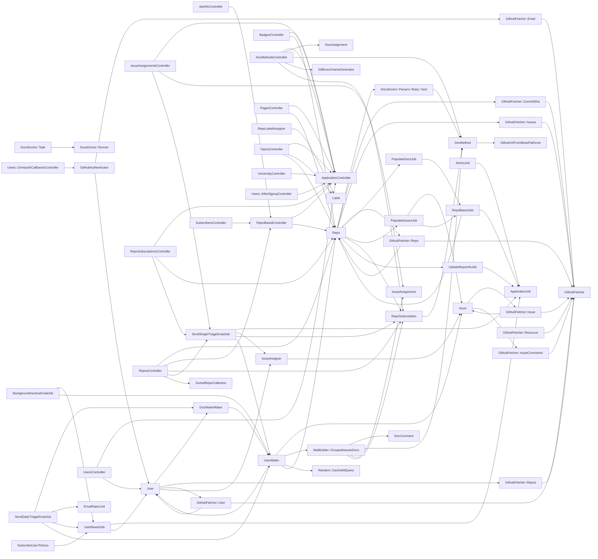

# Module graph

_Structural module graph of 70 constants, 96 edges (Zeitwerk resolve-or-drop; static parse, no Ruby executed)._

## Isolated modules (11)

_No resolved constant edge (leaf or standalone):_

`ApplicationHelper`, `DependencyParser::Php::Parse`, `DependencyParser::Ruby::Parse`, `DocClass`, `DocsDoctor::DocObj`, `DocsDoctor::Loader`, `DocsDoctor::Parser`, `RepoLabel`, `ReposHelper`, `SubscribersHelper`, `UsersHelper`
