# Module graph

_Static TS/JS import graph of 50 modules, 107 edges (resolve-or-drop; static parse, no Node executed)._

```mermaid
graph LR
  src_app_js["src/app.js"] --> src_config_config_js["src/config/config.js"]
  src_app_js["src/app.js"] --> src_config_morgan_js["src/config/morgan.js"]
  src_app_js["src/app.js"] --> src_config_passport_js["src/config/passport.js"]
  src_app_js["src/app.js"] --> src_middlewares_error_js["src/middlewares/error.js"]
  src_app_js["src/app.js"] --> src_middlewares_rateLimiter_js["src/middlewares/rateLimiter.js"]
  src_app_js["src/app.js"] --> src_routes_v1_index_js["src/routes/v1/index.js"]
  src_app_js["src/app.js"] --> src_utils_ApiError_js["src/utils/ApiError.js"]
  src_config_logger_js["src/config/logger.js"] --> src_config_config_js["src/config/config.js"]
  src_config_morgan_js["src/config/morgan.js"] --> src_config_config_js["src/config/config.js"]
  src_config_morgan_js["src/config/morgan.js"] --> src_config_logger_js["src/config/logger.js"]
  src_config_passport_js["src/config/passport.js"] --> src_config_config_js["src/config/config.js"]
  src_config_passport_js["src/config/passport.js"] --> src_config_tokens_js["src/config/tokens.js"]
  src_config_passport_js["src/config/passport.js"] --> src_models_index_js["src/models/index.js"]
  src_controllers_auth_controller_js["src/controllers/auth.controller.js"] --> src_services_index_js["src/services/index.js"]
  src_controllers_auth_controller_js["src/controllers/auth.controller.js"] --> src_utils_catchAsync_js["src/utils/catchAsync.js"]
  src_controllers_index_js["src/controllers/index.js"] --> src_controllers_auth_controller_js["src/controllers/auth.controller.js"]
  src_controllers_index_js["src/controllers/index.js"] --> src_controllers_user_controller_js["src/controllers/user.controller.js"]
  src_controllers_user_controller_js["src/controllers/user.controller.js"] --> src_services_index_js["src/services/index.js"]
  src_controllers_user_controller_js["src/controllers/user.controller.js"] --> src_utils_ApiError_js["src/utils/ApiError.js"]
  src_controllers_user_controller_js["src/controllers/user.controller.js"] --> src_utils_catchAsync_js["src/utils/catchAsync.js"]
  src_controllers_user_controller_js["src/controllers/user.controller.js"] --> src_utils_pick_js["src/utils/pick.js"]
  src_docs_swaggerDef_js["src/docs/swaggerDef.js"] --> src_config_config_js["src/config/config.js"]
  src_index_js["src/index.js"] --> src_app_js["src/app.js"]
  src_index_js["src/index.js"] --> src_config_config_js["src/config/config.js"]
  src_index_js["src/index.js"] --> src_config_logger_js["src/config/logger.js"]
  src_middlewares_auth_js["src/middlewares/auth.js"] --> src_config_roles_js["src/config/roles.js"]
  src_middlewares_auth_js["src/middlewares/auth.js"] --> src_utils_ApiError_js["src/utils/ApiError.js"]
  src_middlewares_error_js["src/middlewares/error.js"] --> src_config_config_js["src/config/config.js"]
  src_middlewares_error_js["src/middlewares/error.js"] --> src_config_logger_js["src/config/logger.js"]
  src_middlewares_error_js["src/middlewares/error.js"] --> src_utils_ApiError_js["src/utils/ApiError.js"]
  src_middlewares_validate_js["src/middlewares/validate.js"] --> src_utils_ApiError_js["src/utils/ApiError.js"]
  src_middlewares_validate_js["src/middlewares/validate.js"] --> src_utils_pick_js["src/utils/pick.js"]
  src_models_index_js["src/models/index.js"] --> src_models_token_model_js["src/models/token.model.js"]
  src_models_index_js["src/models/index.js"] --> src_models_user_model_js["src/models/user.model.js"]
  src_models_plugins_index_js["src/models/plugins/index.js"] --> src_models_plugins_paginate_plugin_js["src/models/plugins/paginate.plugin.js"]
  src_models_plugins_index_js["src/models/plugins/index.js"] --> src_models_plugins_toJSON_plugin_js["src/models/plugins/toJSON.plugin.js"]
  src_models_token_model_js["src/models/token.model.js"] --> src_config_tokens_js["src/config/tokens.js"]
  src_models_token_model_js["src/models/token.model.js"] --> src_models_plugins_index_js["src/models/plugins/index.js"]
  src_models_user_model_js["src/models/user.model.js"] --> src_config_roles_js["src/config/roles.js"]
  src_models_user_model_js["src/models/user.model.js"] --> src_models_plugins_index_js["src/models/plugins/index.js"]
  src_routes_v1_auth_route_js["src/routes/v1/auth.route.js"] --> src_controllers_auth_controller_js["src/controllers/auth.controller.js"]
  src_routes_v1_auth_route_js["src/routes/v1/auth.route.js"] --> src_middlewares_auth_js["src/middlewares/auth.js"]
  src_routes_v1_auth_route_js["src/routes/v1/auth.route.js"] --> src_middlewares_validate_js["src/middlewares/validate.js"]
  src_routes_v1_auth_route_js["src/routes/v1/auth.route.js"] --> src_validations_auth_validation_js["src/validations/auth.validation.js"]
  src_routes_v1_docs_route_js["src/routes/v1/docs.route.js"] --> src_docs_swaggerDef_js["src/docs/swaggerDef.js"]
  src_routes_v1_index_js["src/routes/v1/index.js"] --> src_config_config_js["src/config/config.js"]
  src_routes_v1_index_js["src/routes/v1/index.js"] --> src_routes_v1_auth_route_js["src/routes/v1/auth.route.js"]
  src_routes_v1_index_js["src/routes/v1/index.js"] --> src_routes_v1_docs_route_js["src/routes/v1/docs.route.js"]
  src_routes_v1_index_js["src/routes/v1/index.js"] --> src_routes_v1_user_route_js["src/routes/v1/user.route.js"]
  src_routes_v1_user_route_js["src/routes/v1/user.route.js"] --> src_controllers_user_controller_js["src/controllers/user.controller.js"]
  src_routes_v1_user_route_js["src/routes/v1/user.route.js"] --> src_middlewares_auth_js["src/middlewares/auth.js"]
  src_routes_v1_user_route_js["src/routes/v1/user.route.js"] --> src_middlewares_validate_js["src/middlewares/validate.js"]
  src_routes_v1_user_route_js["src/routes/v1/user.route.js"] --> src_validations_user_validation_js["src/validations/user.validation.js"]
  src_services_auth_service_js["src/services/auth.service.js"] --> src_config_tokens_js["src/config/tokens.js"]
  src_services_auth_service_js["src/services/auth.service.js"] --> src_models_token_model_js["src/models/token.model.js"]
  src_services_auth_service_js["src/services/auth.service.js"] --> src_services_token_service_js["src/services/token.service.js"]
  src_services_auth_service_js["src/services/auth.service.js"] --> src_services_user_service_js["src/services/user.service.js"]
  src_services_auth_service_js["src/services/auth.service.js"] --> src_utils_ApiError_js["src/utils/ApiError.js"]
  src_services_email_service_js["src/services/email.service.js"] --> src_config_config_js["src/config/config.js"]
  src_services_email_service_js["src/services/email.service.js"] --> src_config_logger_js["src/config/logger.js"]
  src_services_index_js["src/services/index.js"] --> src_services_auth_service_js["src/services/auth.service.js"]
  src_services_index_js["src/services/index.js"] --> src_services_email_service_js["src/services/email.service.js"]
  src_services_index_js["src/services/index.js"] --> src_services_token_service_js["src/services/token.service.js"]
  src_services_index_js["src/services/index.js"] --> src_services_user_service_js["src/services/user.service.js"]
  src_services_token_service_js["src/services/token.service.js"] --> src_config_config_js["src/config/config.js"]
  src_services_token_service_js["src/services/token.service.js"] --> src_config_tokens_js["src/config/tokens.js"]
  src_services_token_service_js["src/services/token.service.js"] --> src_models_index_js["src/models/index.js"]
  src_services_token_service_js["src/services/token.service.js"] --> src_services_user_service_js["src/services/user.service.js"]
  src_services_token_service_js["src/services/token.service.js"] --> src_utils_ApiError_js["src/utils/ApiError.js"]
  src_services_user_service_js["src/services/user.service.js"] --> src_models_index_js["src/models/index.js"]
  src_services_user_service_js["src/services/user.service.js"] --> src_utils_ApiError_js["src/utils/ApiError.js"]
  src_validations_auth_validation_js["src/validations/auth.validation.js"] --> src_validations_custom_validation_js["src/validations/custom.validation.js"]
  src_validations_index_js["src/validations/index.js"] --> src_validations_auth_validation_js["src/validations/auth.validation.js"]
  src_validations_index_js["src/validations/index.js"] --> src_validations_user_validation_js["src/validations/user.validation.js"]
  src_validations_user_validation_js["src/validations/user.validation.js"] --> src_validations_custom_validation_js["src/validations/custom.validation.js"]
  tests_fixtures_token_fixture_js["tests/fixtures/token.fixture.js"] --> src_config_config_js["src/config/config.js"]
  tests_fixtures_token_fixture_js["tests/fixtures/token.fixture.js"] --> src_config_tokens_js["src/config/tokens.js"]
  tests_fixtures_token_fixture_js["tests/fixtures/token.fixture.js"] --> src_services_token_service_js["src/services/token.service.js"]
  tests_fixtures_token_fixture_js["tests/fixtures/token.fixture.js"] --> tests_fixtures_user_fixture_js["tests/fixtures/user.fixture.js"]
  tests_fixtures_user_fixture_js["tests/fixtures/user.fixture.js"] --> src_models_user_model_js["src/models/user.model.js"]
  tests_integration_auth_test_js["tests/integration/auth.test.js"] --> src_app_js["src/app.js"]
  tests_integration_auth_test_js["tests/integration/auth.test.js"] --> src_config_config_js["src/config/config.js"]
  tests_integration_auth_test_js["tests/integration/auth.test.js"] --> src_config_roles_js["src/config/roles.js"]
  tests_integration_auth_test_js["tests/integration/auth.test.js"] --> src_config_tokens_js["src/config/tokens.js"]
  tests_integration_auth_test_js["tests/integration/auth.test.js"] --> src_middlewares_auth_js["src/middlewares/auth.js"]
  tests_integration_auth_test_js["tests/integration/auth.test.js"] --> src_models_index_js["src/models/index.js"]
  tests_integration_auth_test_js["tests/integration/auth.test.js"] --> src_services_index_js["src/services/index.js"]
  tests_integration_auth_test_js["tests/integration/auth.test.js"] --> src_utils_ApiError_js["src/utils/ApiError.js"]
  tests_integration_auth_test_js["tests/integration/auth.test.js"] --> tests_fixtures_token_fixture_js["tests/fixtures/token.fixture.js"]
  tests_integration_auth_test_js["tests/integration/auth.test.js"] --> tests_fixtures_user_fixture_js["tests/fixtures/user.fixture.js"]
  tests_integration_auth_test_js["tests/integration/auth.test.js"] --> tests_utils_setupTestDB_js["tests/utils/setupTestDB.js"]
  tests_integration_docs_test_js["tests/integration/docs.test.js"] --> src_app_js["src/app.js"]
  tests_integration_docs_test_js["tests/integration/docs.test.js"] --> src_config_config_js["src/config/config.js"]
  tests_integration_user_test_js["tests/integration/user.test.js"] --> src_app_js["src/app.js"]
  tests_integration_user_test_js["tests/integration/user.test.js"] --> src_models_index_js["src/models/index.js"]
  tests_integration_user_test_js["tests/integration/user.test.js"] --> tests_fixtures_token_fixture_js["tests/fixtures/token.fixture.js"]
  tests_integration_user_test_js["tests/integration/user.test.js"] --> tests_fixtures_user_fixture_js["tests/fixtures/user.fixture.js"]
  tests_integration_user_test_js["tests/integration/user.test.js"] --> tests_utils_setupTestDB_js["tests/utils/setupTestDB.js"]
  tests_unit_middlewares_error_test_js["tests/unit/middlewares/error.test.js"] --> src_config_config_js["src/config/config.js"]
  tests_unit_middlewares_error_test_js["tests/unit/middlewares/error.test.js"] --> src_config_logger_js["src/config/logger.js"]
  tests_unit_middlewares_error_test_js["tests/unit/middlewares/error.test.js"] --> src_middlewares_error_js["src/middlewares/error.js"]
  tests_unit_middlewares_error_test_js["tests/unit/middlewares/error.test.js"] --> src_utils_ApiError_js["src/utils/ApiError.js"]
  tests_unit_models_plugins_paginate_plugin_test_js["tests/unit/models/plugins/paginate.plugin.test.js"] --> src_models_plugins_paginate_plugin_js["src/models/plugins/paginate.plugin.js"]
  tests_unit_models_plugins_paginate_plugin_test_js["tests/unit/models/plugins/paginate.plugin.test.js"] --> tests_utils_setupTestDB_js["tests/utils/setupTestDB.js"]
  tests_unit_models_plugins_toJSON_plugin_test_js["tests/unit/models/plugins/toJSON.plugin.test.js"] --> src_models_plugins_index_js["src/models/plugins/index.js"]
  tests_unit_models_user_model_test_js["tests/unit/models/user.model.test.js"] --> src_models_index_js["src/models/index.js"]
  tests_utils_setupTestDB_js["tests/utils/setupTestDB.js"] --> src_config_config_js["src/config/config.js"]
```

## Isolated modules (2)

_No resolved import edge (leaf or standalone):_

`bin/createNodejsApp.js`, `jest.config.js`
