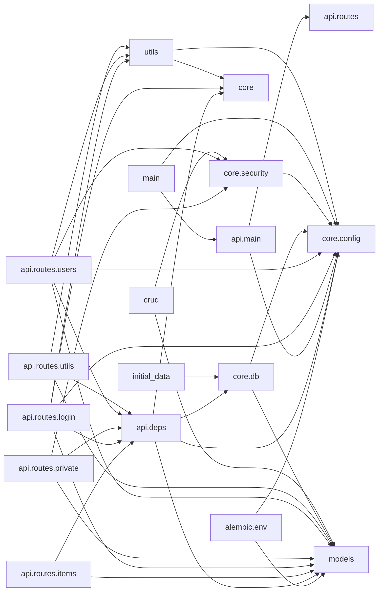

# Module graph

_Intra-package imports of `app` under `backend/app/` (25 modules, 36 edges)._

## Isolated modules (7)

_No intra-package import edge (leaf or standalone):_

`__init__`, `alembic.versions.1a31ce608336_add_cascade_delete_relationships`, `alembic.versions.9c0a54914c78_add_max_length_for_string_varchar_`, `alembic.versions.d98dd8ec85a3_edit_replace_id_integers_in_all_models_`, `alembic.versions.e2412789c190_initialize_models`, `alembic.versions.fe56fa70289e_add_created_at_to_user_and_item`, `api`
