# Module graph

_Elixir module dependency graph of 57 modules, 137 edges (alias/import/use + remote refs, resolve-or-drop; static parse, no Elixir executed)._

```mermaid
graph LR
  LiveBeats_Accounts["LiveBeats.Accounts"] --> LiveBeats["LiveBeats"]
  LiveBeats_Accounts["LiveBeats.Accounts"] --> LiveBeats_Accounts_Events["LiveBeats.Accounts.Events"]
  LiveBeats_Accounts["LiveBeats.Accounts"] --> LiveBeats_Accounts_Identity["LiveBeats.Accounts.Identity"]
  LiveBeats_Accounts["LiveBeats.Accounts"] --> LiveBeats_Accounts_User["LiveBeats.Accounts.User"]
  LiveBeats_Accounts["LiveBeats.Accounts"] --> LiveBeats_Repo["LiveBeats.Repo"]
  LiveBeats_Accounts_Events["LiveBeats.Accounts.Events"] --> ActiveProfileChanged["ActiveProfileChanged"]
  LiveBeats_Accounts_Events["LiveBeats.Accounts.Events"] --> PublicSettingsChanged["PublicSettingsChanged"]
  LiveBeats_Accounts_Identity["LiveBeats.Accounts.Identity"] --> LiveBeats_Accounts["LiveBeats.Accounts"]
  LiveBeats_Accounts_Identity["LiveBeats.Accounts.Identity"] --> LiveBeats_Accounts_User["LiveBeats.Accounts.User"]
  LiveBeats_Accounts_User["LiveBeats.Accounts.User"] --> LiveBeats_Accounts["LiveBeats.Accounts"]
  LiveBeats_Accounts_User["LiveBeats.Accounts.User"] --> LiveBeats_Accounts_Identity["LiveBeats.Accounts.Identity"]
  LiveBeats_Accounts_User["LiveBeats.Accounts.User"] --> LiveBeats_Repo["LiveBeats.Repo"]
  LiveBeats_AccountsFixtures["LiveBeats.AccountsFixtures"] --> LiveBeats_Accounts["LiveBeats.Accounts"]
  LiveBeats_Application["LiveBeats.Application"] --> LiveBeats_MediaLibrary["LiveBeats.MediaLibrary"]
  LiveBeats_Application["LiveBeats.Application"] --> LiveBeats_Repo["LiveBeats.Repo"]
  LiveBeats_Application["LiveBeats.Application"] --> LiveBeats_SongsCleaner["LiveBeats.SongsCleaner"]
  LiveBeats_Application["LiveBeats.Application"] --> LiveBeatsWeb_Endpoint["LiveBeatsWeb.Endpoint"]
  LiveBeats_Application["LiveBeats.Application"] --> LiveBeatsWeb_Presence["LiveBeatsWeb.Presence"]
  LiveBeats_Application["LiveBeats.Application"] --> LiveBeatsWeb_Telemetry["LiveBeatsWeb.Telemetry"]
  LiveBeats_Audio["LiveBeats.Audio"] --> LiveBeats_MP3Stat["LiveBeats.MP3Stat"]
  LiveBeats_DataCase["LiveBeats.DataCase"] --> LiveBeats_Repo["LiveBeats.Repo"]
  LiveBeats_Github["LiveBeats.Github"] --> LiveBeats["LiveBeats"]
  LiveBeats_MediaLibrary["LiveBeats.MediaLibrary"] --> LiveBeats["LiveBeats"]
  LiveBeats_MediaLibrary["LiveBeats.MediaLibrary"] --> LiveBeats_Accounts["LiveBeats.Accounts"]
  LiveBeats_MediaLibrary["LiveBeats.MediaLibrary"] --> LiveBeats_Accounts_User["LiveBeats.Accounts.User"]
  LiveBeats_MediaLibrary["LiveBeats.MediaLibrary"] --> LiveBeats_Audio["LiveBeats.Audio"]
  LiveBeats_MediaLibrary["LiveBeats.MediaLibrary"] --> LiveBeats_MP3Stat["LiveBeats.MP3Stat"]
  LiveBeats_MediaLibrary["LiveBeats.MediaLibrary"] --> LiveBeats_MediaLibrary_Events["LiveBeats.MediaLibrary.Events"]
  LiveBeats_MediaLibrary["LiveBeats.MediaLibrary"] --> LiveBeats_MediaLibrary_Genre["LiveBeats.MediaLibrary.Genre"]
  LiveBeats_MediaLibrary["LiveBeats.MediaLibrary"] --> LiveBeats_MediaLibrary_Profile["LiveBeats.MediaLibrary.Profile"]
  LiveBeats_MediaLibrary["LiveBeats.MediaLibrary"] --> LiveBeats_MediaLibrary_Song["LiveBeats.MediaLibrary.Song"]
  LiveBeats_MediaLibrary["LiveBeats.MediaLibrary"] --> LiveBeats_Repo["LiveBeats.Repo"]
  LiveBeats_MediaLibrary_Events["LiveBeats.MediaLibrary.Events"] --> NewPosition["NewPosition"]
  LiveBeats_MediaLibrary_Events["LiveBeats.MediaLibrary.Events"] --> Pause["Pause"]
  LiveBeats_MediaLibrary_Events["LiveBeats.MediaLibrary.Events"] --> Play["Play"]
  LiveBeats_MediaLibrary_Events["LiveBeats.MediaLibrary.Events"] --> PublicProfileActive["PublicProfileActive"]
  LiveBeats_MediaLibrary_Events["LiveBeats.MediaLibrary.Events"] --> PublicProfileInActive["PublicProfileInActive"]
  LiveBeats_MediaLibrary_Events["LiveBeats.MediaLibrary.Events"] --> PublicProfileUpdated["PublicProfileUpdated"]
  LiveBeats_MediaLibrary_Events["LiveBeats.MediaLibrary.Events"] --> SongDeleted["SongDeleted"]
  LiveBeats_MediaLibrary_Events["LiveBeats.MediaLibrary.Events"] --> SongsImported["SongsImported"]
  LiveBeats_MediaLibrary_Song["LiveBeats.MediaLibrary.Song"] --> LiveBeats["LiveBeats"]
  LiveBeats_MediaLibrary_Song["LiveBeats.MediaLibrary.Song"] --> LiveBeats_Accounts["LiveBeats.Accounts"]
  LiveBeats_MediaLibrary_Song["LiveBeats.MediaLibrary.Song"] --> LiveBeats_Accounts_User["LiveBeats.Accounts.User"]
  LiveBeats_MediaLibrary_Song["LiveBeats.MediaLibrary.Song"] --> LiveBeats_MP3Stat["LiveBeats.MP3Stat"]
  LiveBeats_MediaLibrary_Song["LiveBeats.MediaLibrary.Song"] --> LiveBeats_MediaLibrary["LiveBeats.MediaLibrary"]
  LiveBeats_MediaLibrary_Song["LiveBeats.MediaLibrary.Song"] --> LiveBeats_MediaLibrary_Genre["LiveBeats.MediaLibrary.Genre"]
  LiveBeats_MediaLibraryFixtures["LiveBeats.MediaLibraryFixtures"] --> LiveBeats["LiveBeats"]
  LiveBeats_MediaLibraryFixtures["LiveBeats.MediaLibraryFixtures"] --> LiveBeats_MediaLibrary_Song["LiveBeats.MediaLibrary.Song"]
  LiveBeats_MediaLibraryFixtures["LiveBeats.MediaLibraryFixtures"] --> LiveBeats_Repo["LiveBeats.Repo"]
  LiveBeats_SongsCleaner["LiveBeats.SongsCleaner"] --> LiveBeats_MediaLibrary["LiveBeats.MediaLibrary"]
  LiveBeatsWeb["LiveBeatsWeb"] --> LiveBeatsWeb_CoreComponents["LiveBeatsWeb.CoreComponents"]
  LiveBeatsWeb["LiveBeatsWeb"] --> LiveBeatsWeb_Endpoint["LiveBeatsWeb.Endpoint"]
  LiveBeatsWeb["LiveBeatsWeb"] --> LiveBeatsWeb_Gettext["LiveBeatsWeb.Gettext"]
  LiveBeatsWeb["LiveBeatsWeb"] --> LiveBeatsWeb_Layouts["LiveBeatsWeb.Layouts"]
  LiveBeatsWeb["LiveBeatsWeb"] --> LiveBeatsWeb_Router["LiveBeatsWeb.Router"]
  LiveBeatsWeb_ChannelCase["LiveBeatsWeb.ChannelCase"] --> LiveBeats_Repo["LiveBeats.Repo"]
  LiveBeatsWeb_ChannelCase["LiveBeatsWeb.ChannelCase"] --> LiveBeatsWeb_Endpoint["LiveBeatsWeb.Endpoint"]
  LiveBeatsWeb_ConnCase["LiveBeatsWeb.ConnCase"] --> LiveBeats_Repo["LiveBeats.Repo"]
  LiveBeatsWeb_ConnCase["LiveBeatsWeb.ConnCase"] --> LiveBeatsWeb["LiveBeatsWeb"]
  LiveBeatsWeb_ConnCase["LiveBeatsWeb.ConnCase"] --> LiveBeatsWeb_Endpoint["LiveBeatsWeb.Endpoint"]
  LiveBeatsWeb_ConnCase["LiveBeatsWeb.ConnCase"] --> LiveBeatsWeb_Presence["LiveBeatsWeb.Presence"]
  LiveBeatsWeb_ConnCase["LiveBeatsWeb.ConnCase"] --> LiveBeatsWeb_Router["LiveBeatsWeb.Router"]
  LiveBeatsWeb_ConnCase["LiveBeatsWeb.ConnCase"] --> LiveBeatsWeb_UserAuth["LiveBeatsWeb.UserAuth"]
  LiveBeatsWeb_CoreComponents["LiveBeatsWeb.CoreComponents"] --> LiveBeats_Accounts["LiveBeats.Accounts"]
  LiveBeatsWeb_CoreComponents["LiveBeatsWeb.CoreComponents"] --> LiveBeats_Accounts_User["LiveBeats.Accounts.User"]
  LiveBeatsWeb_CoreComponents["LiveBeatsWeb.CoreComponents"] --> LiveBeats_MediaLibrary["LiveBeats.MediaLibrary"]
  LiveBeatsWeb_CoreComponents["LiveBeatsWeb.CoreComponents"] --> LiveBeats_MediaLibrary_Profile["LiveBeats.MediaLibrary.Profile"]
  LiveBeatsWeb_CoreComponents["LiveBeatsWeb.CoreComponents"] --> LiveBeatsWeb["LiveBeatsWeb"]
  LiveBeatsWeb_CoreComponents["LiveBeatsWeb.CoreComponents"] --> LiveBeatsWeb_Endpoint["LiveBeatsWeb.Endpoint"]
  LiveBeatsWeb_CoreComponents["LiveBeatsWeb.CoreComponents"] --> LiveBeatsWeb_Gettext["LiveBeatsWeb.Gettext"]
  LiveBeatsWeb_CoreComponents["LiveBeatsWeb.CoreComponents"] --> LiveBeatsWeb_Router["LiveBeatsWeb.Router"]
  LiveBeatsWeb_Endpoint["LiveBeatsWeb.Endpoint"] --> LiveBeatsWeb["LiveBeatsWeb"]
  LiveBeatsWeb_Endpoint["LiveBeatsWeb.Endpoint"] --> LiveBeatsWeb_Router["LiveBeatsWeb.Router"]
  LiveBeatsWeb_ErrorHTML["LiveBeatsWeb.ErrorHTML"] --> LiveBeatsWeb["LiveBeatsWeb"]
  LiveBeatsWeb_FileController["LiveBeatsWeb.FileController"] --> LiveBeats["LiveBeats"]
  LiveBeatsWeb_FileController["LiveBeatsWeb.FileController"] --> LiveBeats_MediaLibrary["LiveBeats.MediaLibrary"]
  LiveBeatsWeb_FileController["LiveBeatsWeb.FileController"] --> LiveBeatsWeb["LiveBeatsWeb"]
  LiveBeatsWeb_FileController["LiveBeatsWeb.FileController"] --> LiveBeatsWeb_Endpoint["LiveBeatsWeb.Endpoint"]
  LiveBeatsWeb_Layouts["LiveBeatsWeb.Layouts"] --> LiveBeatsWeb["LiveBeatsWeb"]
  LiveBeatsWeb_Nav["LiveBeatsWeb.Nav"] --> LiveBeats["LiveBeats"]
  LiveBeatsWeb_Nav["LiveBeatsWeb.Nav"] --> LiveBeats_Accounts["LiveBeats.Accounts"]
  LiveBeatsWeb_Nav["LiveBeatsWeb.Nav"] --> LiveBeats_Accounts_User["LiveBeats.Accounts.User"]
  LiveBeatsWeb_Nav["LiveBeatsWeb.Nav"] --> LiveBeats_MediaLibrary["LiveBeats.MediaLibrary"]
  LiveBeatsWeb_Nav["LiveBeatsWeb.Nav"] --> LiveBeatsWeb["LiveBeatsWeb"]
  LiveBeatsWeb_Nav["LiveBeatsWeb.Nav"] --> LiveBeatsWeb_ProfileLive["LiveBeatsWeb.ProfileLive"]
  LiveBeatsWeb_Nav["LiveBeatsWeb.Nav"] --> LiveBeatsWeb_SettingsLive["LiveBeatsWeb.SettingsLive"]
  LiveBeatsWeb_OAuthCallbackController["LiveBeatsWeb.OAuthCallbackController"] --> LiveBeats_Accounts["LiveBeats.Accounts"]
  LiveBeatsWeb_OAuthCallbackController["LiveBeatsWeb.OAuthCallbackController"] --> LiveBeats_Github["LiveBeats.Github"]
  LiveBeatsWeb_OAuthCallbackController["LiveBeatsWeb.OAuthCallbackController"] --> LiveBeatsWeb["LiveBeatsWeb"]
  LiveBeatsWeb_OAuthCallbackController["LiveBeatsWeb.OAuthCallbackController"] --> LiveBeatsWeb_UserAuth["LiveBeatsWeb.UserAuth"]
  LiveBeatsWeb_PlayerLive["LiveBeatsWeb.PlayerLive"] --> LiveBeats["LiveBeats"]
  LiveBeatsWeb_PlayerLive["LiveBeatsWeb.PlayerLive"] --> LiveBeats_Accounts["LiveBeats.Accounts"]
  LiveBeatsWeb_PlayerLive["LiveBeatsWeb.PlayerLive"] --> LiveBeats_MediaLibrary["LiveBeats.MediaLibrary"]
  LiveBeatsWeb_PlayerLive["LiveBeatsWeb.PlayerLive"] --> LiveBeats_MediaLibrary_Profile["LiveBeats.MediaLibrary.Profile"]
  LiveBeatsWeb_PlayerLive["LiveBeatsWeb.PlayerLive"] --> LiveBeats_MediaLibrary_Song["LiveBeats.MediaLibrary.Song"]
  LiveBeatsWeb_PlayerLive["LiveBeatsWeb.PlayerLive"] --> LiveBeatsWeb["LiveBeatsWeb"]
  LiveBeatsWeb_PlayerLive["LiveBeatsWeb.PlayerLive"] --> LiveBeatsWeb_Presence["LiveBeatsWeb.Presence"]
  LiveBeatsWeb_PlayerLive["LiveBeatsWeb.PlayerLive"] --> LiveBeatsWeb_UserAuth["LiveBeatsWeb.UserAuth"]
  LiveBeatsWeb_Presence["LiveBeatsWeb.Presence"] --> LiveBeats["LiveBeats"]
  LiveBeatsWeb_Presence["LiveBeatsWeb.Presence"] --> LiveBeats_Accounts["LiveBeats.Accounts"]
  LiveBeatsWeb_Presence["LiveBeatsWeb.Presence"] --> LiveBeats_MediaLibrary["LiveBeats.MediaLibrary"]
  LiveBeatsWeb_Presence["LiveBeatsWeb.Presence"] --> LiveBeats_MediaLibrary_Profile["LiveBeats.MediaLibrary.Profile"]
  LiveBeatsWeb_Presence["LiveBeatsWeb.Presence"] --> LiveBeatsWeb["LiveBeatsWeb"]
  LiveBeatsWeb_Presence["LiveBeatsWeb.Presence"] --> LiveBeatsWeb_Presence_BadgeComponent["LiveBeatsWeb.Presence.BadgeComponent"]
  LiveBeatsWeb_ProfileLive["LiveBeatsWeb.ProfileLive"] --> LiveBeats["LiveBeats"]
  LiveBeatsWeb_ProfileLive["LiveBeatsWeb.ProfileLive"] --> LiveBeats_Accounts["LiveBeats.Accounts"]
  LiveBeatsWeb_ProfileLive["LiveBeatsWeb.ProfileLive"] --> LiveBeats_MP3Stat["LiveBeats.MP3Stat"]
  LiveBeatsWeb_ProfileLive["LiveBeatsWeb.ProfileLive"] --> LiveBeats_MediaLibrary["LiveBeats.MediaLibrary"]
  LiveBeatsWeb_ProfileLive["LiveBeatsWeb.ProfileLive"] --> LiveBeats_MediaLibrary_Song["LiveBeats.MediaLibrary.Song"]
  LiveBeatsWeb_ProfileLive["LiveBeatsWeb.ProfileLive"] --> LiveBeatsWeb["LiveBeatsWeb"]
  LiveBeatsWeb_ProfileLive["LiveBeatsWeb.ProfileLive"] --> LiveBeatsWeb_Presence["LiveBeatsWeb.Presence"]
  LiveBeatsWeb_ProfileLive["LiveBeatsWeb.ProfileLive"] --> LiveBeatsWeb_Presence_BadgeComponent["LiveBeatsWeb.Presence.BadgeComponent"]
  LiveBeatsWeb_ProfileLive["LiveBeatsWeb.ProfileLive"] --> LiveBeatsWeb_ProfileLive_UploadFormComponent["LiveBeatsWeb.ProfileLive.UploadFormComponent"]
  LiveBeatsWeb_ProfileLive_SongEntryComponent["LiveBeatsWeb.ProfileLive.SongEntryComponent"] --> LiveBeats_MP3Stat["LiveBeats.MP3Stat"]
  LiveBeatsWeb_ProfileLive_SongEntryComponent["LiveBeatsWeb.ProfileLive.SongEntryComponent"] --> LiveBeatsWeb["LiveBeatsWeb"]
  LiveBeatsWeb_ProfileLive_SongRowComponent["LiveBeatsWeb.ProfileLive.SongRowComponent"] --> LiveBeatsWeb["LiveBeatsWeb"]
  LiveBeatsWeb_ProfileLive_UploadFormComponent["LiveBeatsWeb.ProfileLive.UploadFormComponent"] --> LiveBeats["LiveBeats"]
  LiveBeatsWeb_ProfileLive_UploadFormComponent["LiveBeatsWeb.ProfileLive.UploadFormComponent"] --> LiveBeats_MP3Stat["LiveBeats.MP3Stat"]
  LiveBeatsWeb_ProfileLive_UploadFormComponent["LiveBeatsWeb.ProfileLive.UploadFormComponent"] --> LiveBeats_MediaLibrary["LiveBeats.MediaLibrary"]
  LiveBeatsWeb_ProfileLive_UploadFormComponent["LiveBeatsWeb.ProfileLive.UploadFormComponent"] --> LiveBeats_MediaLibrary_Song["LiveBeats.MediaLibrary.Song"]
  LiveBeatsWeb_ProfileLive_UploadFormComponent["LiveBeatsWeb.ProfileLive.UploadFormComponent"] --> LiveBeatsWeb["LiveBeatsWeb"]
  LiveBeatsWeb_ProfileLive_UploadFormComponent["LiveBeatsWeb.ProfileLive.UploadFormComponent"] --> LiveBeatsWeb_ProfileLive_SongEntryComponent["LiveBeatsWeb.ProfileLive.SongEntryComponent"]
  LiveBeatsWeb_RedirectController["LiveBeatsWeb.RedirectController"] --> LiveBeatsWeb["LiveBeatsWeb"]
  LiveBeatsWeb_RedirectController["LiveBeatsWeb.RedirectController"] --> LiveBeatsWeb_UserAuth["LiveBeatsWeb.UserAuth"]
  LiveBeatsWeb_Router["LiveBeatsWeb.Router"] --> LiveBeatsWeb["LiveBeatsWeb"]
  LiveBeatsWeb_Router["LiveBeatsWeb.Router"] --> LiveBeatsWeb_Layouts["LiveBeatsWeb.Layouts"]
  LiveBeatsWeb_Router["LiveBeatsWeb.Router"] --> LiveBeatsWeb_Nav["LiveBeatsWeb.Nav"]
  LiveBeatsWeb_Router["LiveBeatsWeb.Router"] --> LiveBeatsWeb_Telemetry["LiveBeatsWeb.Telemetry"]
  LiveBeatsWeb_Router["LiveBeatsWeb.Router"] --> LiveBeatsWeb_UserAuth["LiveBeatsWeb.UserAuth"]
  LiveBeatsWeb_SettingsLive["LiveBeatsWeb.SettingsLive"] --> LiveBeats_Accounts["LiveBeats.Accounts"]
  LiveBeatsWeb_SettingsLive["LiveBeatsWeb.SettingsLive"] --> LiveBeatsWeb["LiveBeatsWeb"]
  LiveBeatsWeb_SignInLive["LiveBeatsWeb.SignInLive"] --> LiveBeatsWeb["LiveBeatsWeb"]
  LiveBeatsWeb_UserAuth["LiveBeatsWeb.UserAuth"] --> LiveBeats_Accounts["LiveBeats.Accounts"]
  LiveBeatsWeb_UserAuth["LiveBeatsWeb.UserAuth"] --> LiveBeats_Accounts_User["LiveBeats.Accounts.User"]
  LiveBeatsWeb_UserAuth["LiveBeatsWeb.UserAuth"] --> LiveBeatsWeb["LiveBeatsWeb"]
  LiveBeatsWeb_UserAuth["LiveBeatsWeb.UserAuth"] --> LiveBeatsWeb_CoreComponents["LiveBeatsWeb.CoreComponents"]
  LiveBeatsWeb_UserAuth["LiveBeatsWeb.UserAuth"] --> LiveBeatsWeb_Endpoint["LiveBeatsWeb.Endpoint"]
```

## Isolated modules (4)

_No resolved dependency edge (leaf or standalone):_

`LiveBeats.Mailer`, `LiveBeats.Release`, `Phoenix.Presence.Client.Mock`, `Phoenix.Presence.Client.PresenceMock`

## Residuals

- Nested `defmodule` definitions attributed to the enclosing module (a named residual): `lib/live_beats/accounts/events.ex`, `lib/live_beats/media_library/events.ex`, `lib/live_beats_web/channels/presence.ex`.
