# Module graph

_Static TS/JS import graph of 49 modules, 90 edges (resolve-or-drop; static parse, no Node executed)._

```mermaid
graph LR
  src_app_controller_spec_ts["src/app.controller.spec.ts"] --> src_app_controller_ts["src/app.controller.ts"]
  src_app_controller_spec_ts["src/app.controller.spec.ts"] --> src_app_service_ts["src/app.service.ts"]
  src_app_controller_ts["src/app.controller.ts"] --> src_app_service_ts["src/app.service.ts"]
  src_app_module_ts["src/app.module.ts"] --> src_app_controller_ts["src/app.controller.ts"]
  src_app_module_ts["src/app.module.ts"] --> src_app_resolver_ts["src/app.resolver.ts"]
  src_app_module_ts["src/app.module.ts"] --> src_app_service_ts["src/app.service.ts"]
  src_app_module_ts["src/app.module.ts"] --> src_auth_auth_module_ts["src/auth/auth.module.ts"]
  src_app_module_ts["src/app.module.ts"] --> src_common_configs_config_ts["src/common/configs/config.ts"]
  src_app_module_ts["src/app.module.ts"] --> src_gql_config_service_ts["src/gql-config.service.ts"]
  src_app_module_ts["src/app.module.ts"] --> src_posts_posts_module_ts["src/posts/posts.module.ts"]
  src_app_module_ts["src/app.module.ts"] --> src_users_users_module_ts["src/users/users.module.ts"]
  src_app_resolver_spec_ts["src/app.resolver.spec.ts"] --> src_app_resolver_ts["src/app.resolver.ts"]
  src_app_resolver_spec_ts["src/app.resolver.spec.ts"] --> src_app_service_ts["src/app.service.ts"]
  src_auth_auth_module_ts["src/auth/auth.module.ts"] --> src_auth_auth_resolver_ts["src/auth/auth.resolver.ts"]
  src_auth_auth_module_ts["src/auth/auth.module.ts"] --> src_auth_auth_service_ts["src/auth/auth.service.ts"]
  src_auth_auth_module_ts["src/auth/auth.module.ts"] --> src_auth_gql_auth_guard_ts["src/auth/gql-auth.guard.ts"]
  src_auth_auth_module_ts["src/auth/auth.module.ts"] --> src_auth_jwt_strategy_ts["src/auth/jwt.strategy.ts"]
  src_auth_auth_module_ts["src/auth/auth.module.ts"] --> src_auth_password_service_ts["src/auth/password.service.ts"]
  src_auth_auth_module_ts["src/auth/auth.module.ts"] --> src_common_configs_config_interface_ts["src/common/configs/config.interface.ts"]
  src_auth_auth_resolver_ts["src/auth/auth.resolver.ts"] --> src_auth_auth_service_ts["src/auth/auth.service.ts"]
  src_auth_auth_resolver_ts["src/auth/auth.resolver.ts"] --> src_auth_dto_login_input_ts["src/auth/dto/login.input.ts"]
  src_auth_auth_resolver_ts["src/auth/auth.resolver.ts"] --> src_auth_dto_refresh_token_input_ts["src/auth/dto/refresh-token.input.ts"]
  src_auth_auth_resolver_ts["src/auth/auth.resolver.ts"] --> src_auth_dto_signup_input_ts["src/auth/dto/signup.input.ts"]
  src_auth_auth_resolver_ts["src/auth/auth.resolver.ts"] --> src_auth_models_auth_model_ts["src/auth/models/auth.model.ts"]
  src_auth_auth_resolver_ts["src/auth/auth.resolver.ts"] --> src_auth_models_token_model_ts["src/auth/models/token.model.ts"]
  src_auth_auth_resolver_ts["src/auth/auth.resolver.ts"] --> src_users_models_user_model_ts["src/users/models/user.model.ts"]
  src_auth_auth_service_ts["src/auth/auth.service.ts"] --> src_auth_dto_signup_input_ts["src/auth/dto/signup.input.ts"]
  src_auth_auth_service_ts["src/auth/auth.service.ts"] --> src_auth_models_token_model_ts["src/auth/models/token.model.ts"]
  src_auth_auth_service_ts["src/auth/auth.service.ts"] --> src_auth_password_service_ts["src/auth/password.service.ts"]
  src_auth_auth_service_ts["src/auth/auth.service.ts"] --> src_common_configs_config_interface_ts["src/common/configs/config.interface.ts"]
  src_auth_jwt_strategy_ts["src/auth/jwt.strategy.ts"] --> src_auth_auth_service_ts["src/auth/auth.service.ts"]
  src_auth_jwt_strategy_ts["src/auth/jwt.strategy.ts"] --> src_auth_dto_jwt_dto_ts["src/auth/dto/jwt.dto.ts"]
  src_auth_models_auth_model_ts["src/auth/models/auth.model.ts"] --> src_auth_models_token_model_ts["src/auth/models/token.model.ts"]
  src_auth_models_auth_model_ts["src/auth/models/auth.model.ts"] --> src_users_models_user_model_ts["src/users/models/user.model.ts"]
  src_auth_password_service_spec_ts["src/auth/password.service.spec.ts"] --> src_auth_password_service_ts["src/auth/password.service.ts"]
  src_auth_password_service_ts["src/auth/password.service.ts"] --> src_common_configs_config_interface_ts["src/common/configs/config.interface.ts"]
  src_common_configs_config_ts["src/common/configs/config.ts"] --> src_common_configs_config_interface_ts["src/common/configs/config.interface.ts"]
  src_common_order_order_ts["src/common/order/order.ts"] --> src_common_order_order_direction_ts["src/common/order/order-direction.ts"]
  src_common_pagination_pagination_ts["src/common/pagination/pagination.ts"] --> src_common_pagination_page_info_model_ts["src/common/pagination/page-info.model.ts"]
  src_gql_config_service_ts["src/gql-config.service.ts"] --> src_common_configs_config_interface_ts["src/common/configs/config.interface.ts"]
  src_main_ts["src/main.ts"] --> src_app_module_ts["src/app.module.ts"]
  src_main_ts["src/main.ts"] --> src_common_configs_config_interface_ts["src/common/configs/config.interface.ts"]
  src_metadata_ts["src/metadata.ts"] --> src_app_controller_ts["src/app.controller.ts"]
  src_metadata_ts["src/metadata.ts"] --> src_auth_dto_login_input_ts["src/auth/dto/login.input.ts"]
  src_metadata_ts["src/metadata.ts"] --> src_auth_dto_refresh_token_input_ts["src/auth/dto/refresh-token.input.ts"]
  src_metadata_ts["src/metadata.ts"] --> src_auth_dto_signup_input_ts["src/auth/dto/signup.input.ts"]
  src_metadata_ts["src/metadata.ts"] --> src_auth_models_auth_model_ts["src/auth/models/auth.model.ts"]
  src_metadata_ts["src/metadata.ts"] --> src_auth_models_token_model_ts["src/auth/models/token.model.ts"]
  src_metadata_ts["src/metadata.ts"] --> src_common_models_base_model_ts["src/common/models/base.model.ts"]
  src_metadata_ts["src/metadata.ts"] --> src_common_pagination_page_info_model_ts["src/common/pagination/page-info.model.ts"]
  src_metadata_ts["src/metadata.ts"] --> src_common_pagination_pagination_args_ts["src/common/pagination/pagination.args.ts"]
  src_metadata_ts["src/metadata.ts"] --> src_posts_args_post_id_args_ts["src/posts/args/post-id.args.ts"]
  src_metadata_ts["src/metadata.ts"] --> src_posts_args_user_id_args_ts["src/posts/args/user-id.args.ts"]
  src_metadata_ts["src/metadata.ts"] --> src_posts_dto_createPost_input_ts["src/posts/dto/createPost.input.ts"]
  src_metadata_ts["src/metadata.ts"] --> src_posts_dto_post_order_input_ts["src/posts/dto/post-order.input.ts"]
  src_metadata_ts["src/metadata.ts"] --> src_posts_models_post_connection_model_ts["src/posts/models/post-connection.model.ts"]
  src_metadata_ts["src/metadata.ts"] --> src_posts_models_post_model_ts["src/posts/models/post.model.ts"]
  src_metadata_ts["src/metadata.ts"] --> src_users_dto_change_password_input_ts["src/users/dto/change-password.input.ts"]
  src_metadata_ts["src/metadata.ts"] --> src_users_dto_update_user_input_ts["src/users/dto/update-user.input.ts"]
  src_metadata_ts["src/metadata.ts"] --> src_users_models_user_model_ts["src/users/models/user.model.ts"]
  src_posts_dto_post_order_input_ts["src/posts/dto/post-order.input.ts"] --> src_common_order_order_ts["src/common/order/order.ts"]
  src_posts_models_post_connection_model_ts["src/posts/models/post-connection.model.ts"] --> src_common_pagination_pagination_ts["src/common/pagination/pagination.ts"]
  src_posts_models_post_connection_model_ts["src/posts/models/post-connection.model.ts"] --> src_posts_models_post_model_ts["src/posts/models/post.model.ts"]
  src_posts_models_post_model_ts["src/posts/models/post.model.ts"] --> src_common_models_base_model_ts["src/common/models/base.model.ts"]
  src_posts_models_post_model_ts["src/posts/models/post.model.ts"] --> src_users_models_user_model_ts["src/users/models/user.model.ts"]
  src_posts_posts_module_ts["src/posts/posts.module.ts"] --> src_posts_posts_resolver_ts["src/posts/posts.resolver.ts"]
  src_posts_posts_resolver_ts["src/posts/posts.resolver.ts"] --> src_auth_gql_auth_guard_ts["src/auth/gql-auth.guard.ts"]
  src_posts_posts_resolver_ts["src/posts/posts.resolver.ts"] --> src_common_decorators_user_decorator_ts["src/common/decorators/user.decorator.ts"]
  src_posts_posts_resolver_ts["src/posts/posts.resolver.ts"] --> src_common_pagination_pagination_args_ts["src/common/pagination/pagination.args.ts"]
  src_posts_posts_resolver_ts["src/posts/posts.resolver.ts"] --> src_posts_args_post_id_args_ts["src/posts/args/post-id.args.ts"]
  src_posts_posts_resolver_ts["src/posts/posts.resolver.ts"] --> src_posts_args_user_id_args_ts["src/posts/args/user-id.args.ts"]
  src_posts_posts_resolver_ts["src/posts/posts.resolver.ts"] --> src_posts_dto_createPost_input_ts["src/posts/dto/createPost.input.ts"]
  src_posts_posts_resolver_ts["src/posts/posts.resolver.ts"] --> src_posts_dto_post_order_input_ts["src/posts/dto/post-order.input.ts"]
  src_posts_posts_resolver_ts["src/posts/posts.resolver.ts"] --> src_posts_models_post_connection_model_ts["src/posts/models/post-connection.model.ts"]
  src_posts_posts_resolver_ts["src/posts/posts.resolver.ts"] --> src_posts_models_post_model_ts["src/posts/models/post.model.ts"]
  src_posts_posts_resolver_ts["src/posts/posts.resolver.ts"] --> src_users_models_user_model_ts["src/users/models/user.model.ts"]
  src_users_models_user_model_ts["src/users/models/user.model.ts"] --> src_common_models_base_model_ts["src/common/models/base.model.ts"]
  src_users_models_user_model_ts["src/users/models/user.model.ts"] --> src_posts_models_post_model_ts["src/posts/models/post.model.ts"]
  src_users_users_module_ts["src/users/users.module.ts"] --> src_auth_password_service_ts["src/auth/password.service.ts"]
  src_users_users_module_ts["src/users/users.module.ts"] --> src_users_users_resolver_ts["src/users/users.resolver.ts"]
  src_users_users_module_ts["src/users/users.module.ts"] --> src_users_users_service_ts["src/users/users.service.ts"]
  src_users_users_resolver_ts["src/users/users.resolver.ts"] --> src_auth_gql_auth_guard_ts["src/auth/gql-auth.guard.ts"]
  src_users_users_resolver_ts["src/users/users.resolver.ts"] --> src_common_decorators_user_decorator_ts["src/common/decorators/user.decorator.ts"]
  src_users_users_resolver_ts["src/users/users.resolver.ts"] --> src_users_dto_change_password_input_ts["src/users/dto/change-password.input.ts"]
  src_users_users_resolver_ts["src/users/users.resolver.ts"] --> src_users_dto_update_user_input_ts["src/users/dto/update-user.input.ts"]
  src_users_users_resolver_ts["src/users/users.resolver.ts"] --> src_users_models_user_model_ts["src/users/models/user.model.ts"]
  src_users_users_resolver_ts["src/users/users.resolver.ts"] --> src_users_users_service_ts["src/users/users.service.ts"]
  src_users_users_service_ts["src/users/users.service.ts"] --> src_auth_password_service_ts["src/auth/password.service.ts"]
  src_users_users_service_ts["src/users/users.service.ts"] --> src_users_dto_change_password_input_ts["src/users/dto/change-password.input.ts"]
  src_users_users_service_ts["src/users/users.service.ts"] --> src_users_dto_update_user_input_ts["src/users/dto/update-user.input.ts"]
```

## Isolated modules (4)

_No resolved import edge (leaf or standalone):_

`.eslintrc.js`, `prisma/seed.ts`, `test/app.e2e-spec.ts`, `test/app.resolver.e2e-spec.ts`
