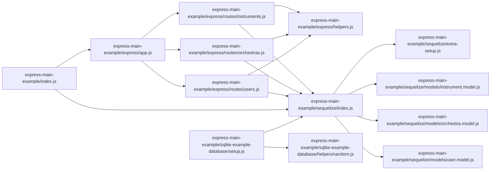

# Module graph

_Static TS/JS import graph of 13 modules, 17 edges (resolve-or-drop; static parse, no Node executed)._

```mermaid
graph LR
  express_main_example_express_app_js["express-main-example/express/app.js"] --> express_main_example_express_routes_instruments_js["express-main-example/express/routes/instruments.js"]
  express_main_example_express_app_js["express-main-example/express/app.js"] --> express_main_example_express_routes_orchestras_js["express-main-example/express/routes/orchestras.js"]
  express_main_example_express_app_js["express-main-example/express/app.js"] --> express_main_example_express_routes_users_js["express-main-example/express/routes/users.js"]
  express_main_example_express_routes_instruments_js["express-main-example/express/routes/instruments.js"] --> express_main_example_express_helpers_js["express-main-example/express/helpers.js"]
  express_main_example_express_routes_instruments_js["express-main-example/express/routes/instruments.js"] --> express_main_example_sequelize_index_js["express-main-example/sequelize/index.js"]
  express_main_example_express_routes_orchestras_js["express-main-example/express/routes/orchestras.js"] --> express_main_example_express_helpers_js["express-main-example/express/helpers.js"]
  express_main_example_express_routes_orchestras_js["express-main-example/express/routes/orchestras.js"] --> express_main_example_sequelize_index_js["express-main-example/sequelize/index.js"]
  express_main_example_express_routes_users_js["express-main-example/express/routes/users.js"] --> express_main_example_express_helpers_js["express-main-example/express/helpers.js"]
  express_main_example_express_routes_users_js["express-main-example/express/routes/users.js"] --> express_main_example_sequelize_index_js["express-main-example/sequelize/index.js"]
  express_main_example_index_js["express-main-example/index.js"] --> express_main_example_express_app_js["express-main-example/express/app.js"]
  express_main_example_index_js["express-main-example/index.js"] --> express_main_example_sequelize_index_js["express-main-example/sequelize/index.js"]
  express_main_example_sequelize_index_js["express-main-example/sequelize/index.js"] --> express_main_example_sequelize_extra_setup_js["express-main-example/sequelize/extra-setup.js"]
  express_main_example_sequelize_index_js["express-main-example/sequelize/index.js"] --> express_main_example_sequelize_models_instrument_model_js["express-main-example/sequelize/models/instrument.model.js"]
  express_main_example_sequelize_index_js["express-main-example/sequelize/index.js"] --> express_main_example_sequelize_models_orchestra_model_js["express-main-example/sequelize/models/orchestra.model.js"]
  express_main_example_sequelize_index_js["express-main-example/sequelize/index.js"] --> express_main_example_sequelize_models_user_model_js["express-main-example/sequelize/models/user.model.js"]
  express_main_example_sqlite_example_database_setup_js["express-main-example/sqlite-example-database/setup.js"] --> express_main_example_sequelize_index_js["express-main-example/sequelize/index.js"]
  express_main_example_sqlite_example_database_setup_js["express-main-example/sqlite-example-database/setup.js"] --> express_main_example_sqlite_example_database_helpers_random_js["express-main-example/sqlite-example-database/helpers/random.js"]
```
