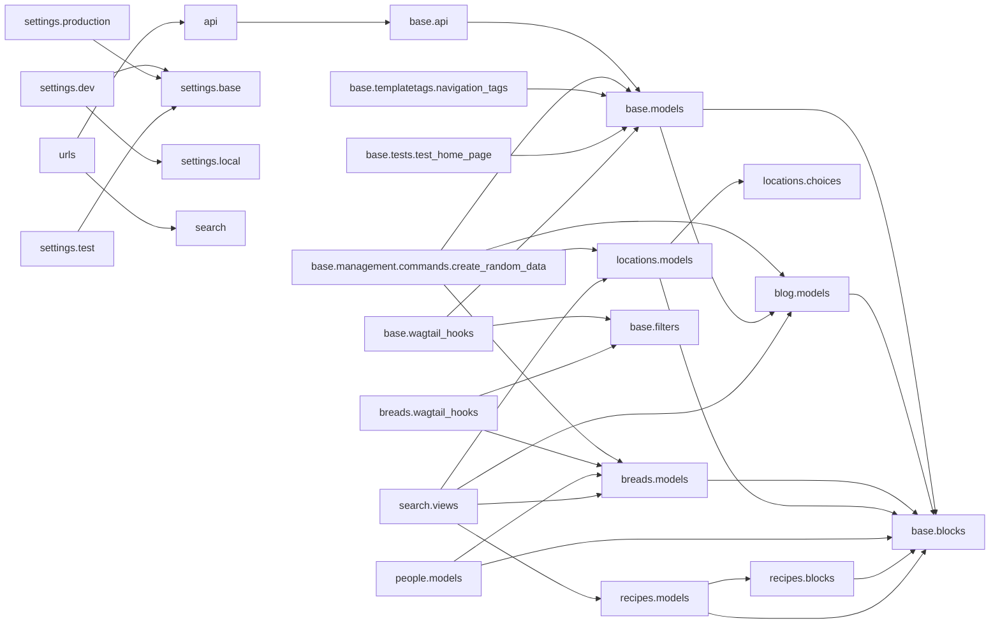

# Module graph

_Intra-package imports of `bakerydemo` under `bakerydemo/` (107 modules, 33 edges)._

## Isolated modules (83)

_No intra-package import edge (leaf or standalone):_

`__init__`, `base`, `base.management`, `base.management.commands`, `base.management.commands.load_initial_data`, `base.management.commands.reset_admin_password`, `base.management.commands.reset_demo`, `base.migrations`, `base.migrations.0001_initial`, `base.migrations.0002_auto_20170329_0055`, `base.migrations.0003_auto_20170823_1127`, `base.migrations.0004_auto_20180522_1856`, `base.migrations.0005_formfield_clean_name`, `base.migrations.0006_char_field_remove_null`, `base.migrations.0007_alter_formfield_choices_and_more`, `base.migrations.0008_use_json_field_for_body_streamfield`, `base.migrations.0009_alter_homepage_promo_text`, `base.migrations.0010_rename_people_person`, `base.migrations.0011_footertext_expire_at_footertext_expired_and_more`, `base.migrations.0012_person_expire_at_person_expired_and_more`, `base.migrations.0013_person_lockablemixin`, `base.migrations.0014_person_enable_default_workflow`, `base.migrations.0015_footertext_translatable`, `base.migrations.0016_footertext_bootstrap_translation`, `base.migrations.0017_footertext_enforce_not_null`, `base.migrations.0018_add_genericsettings_and_sitesettings`, `base.migrations.0019_userapprovaltask`, `base.migrations.0020_alter_footertext_options`, `base.migrations.0021_alter_footertext_locale`, `base.migrations.0022_remove_genericsettings_twitter_url_and_more`, `base.migrations.0023_alter_person_options`, `base.migrations.0024_alter_formpage_body_alter_gallerypage_body_and_more`, `base.migrations.0025_homepage_featured_help_text`, `base.migrations.0026_alter_formpage_body_alter_gallerypage_body_and_more`, `base.migrations.0027_rename_promo_image_homepage_lead_image_and_more`, `base.templatetags`, `base.templatetags.gallery_tags`, `base.tests`, `blog`, `blog.migrations`, `blog.migrations.0001_initial`, `blog.migrations.0002_remove_blogindexpage_body`, `blog.migrations.0003_auto_20170329_0055`, `blog.migrations.0004_alter_blogpagetag_tag`, `blog.migrations.0005_use_json_field_for_body_streamfield`, `blog.migrations.0006_rename_blogpeoplerelationship_person`, `blog.migrations.0007_alter_blogpage_body`, `blog.migrations.0008_alter_blogpage_body`, `breads`, `breads.migrations`, `breads.migrations.0001_initial`, `breads.migrations.0002_remove_breadsindexpage_body`, `breads.migrations.0003_auto_20170329_0055`, `breads.migrations.0004_use_json_field_for_body_streamfield`, `breads.migrations.0005_breadtype_latest_revision`, `breads.migrations.0006_breadingredient_expire_at_breadingredient_expired_and_more`, `breads.migrations.0007_alter_breadingredient_options_and_more`, `breads.migrations.0008_alter_breadpage_body`, `breads.migrations.0009_alter_breadpage_body`, `breads.migrations.0010_alter_breadingredient_options_alter_country_options_and_more`, `locations`, `locations.migrations`, `locations.migrations.0001_initial`, `locations.migrations.0002_remove_locationsindexpage_body`, `locations.migrations.0003_auto_20170329_0055`, `locations.migrations.0004_auto_20190912_1149`, `locations.migrations.0005_use_json_field_for_body_streamfield`, `locations.migrations.0006_alter_locationoperatinghours_day`, `locations.migrations.0007_alter_locationpage_body`, `locations.migrations.0008_alter_locationpage_body`, `people`, `people.migrations`, `people.migrations.0001_initial`, `people.migrations.0002_personpage_location`, `people.migrations.0003_personpage_social_links`, `recipes`, `recipes.migrations`, `recipes.migrations.0001_initial`, `recipes.migrations.0002_alter_recipepage_body`, `recipes.migrations.0003_alter_recipepage_backstory_alter_recipepage_body`, `recipes.migrations.0004_alter_recipepage_backstory_alter_recipepage_body`, `settings`, `wsgi`
